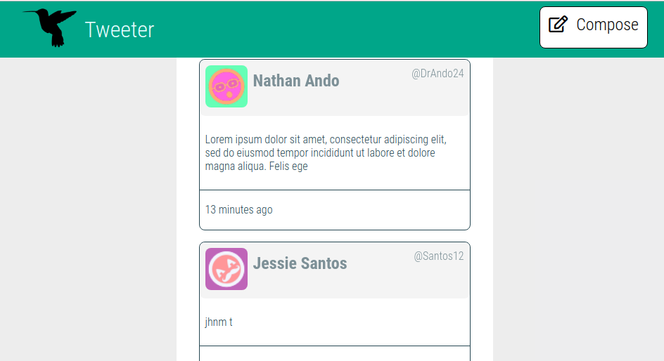
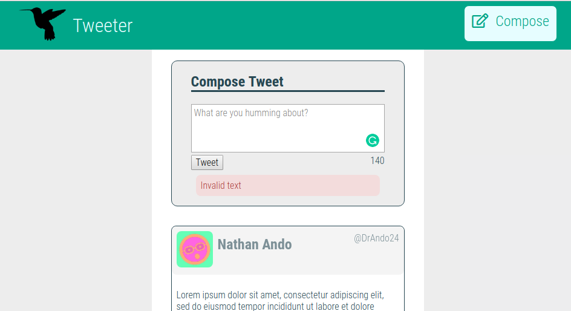
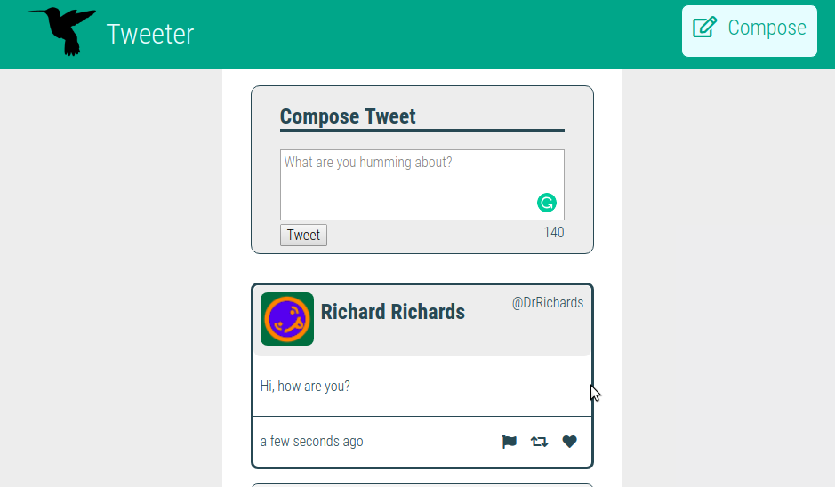

# Tweeter Project

Tweeter is a simple, single-page Twitter clone built using:

**Front-end:**
* HTML, CSS (flexbox and viewpoint), JS, jQuery and AJAX
**Back-end:**
* Node, Express and MongoDB

## Final Product

The user can only like a tweeter after they are logged-in.
If a message is displayed under  the navbar, to make it disappear, you need to click the message.

#### Main Page

#### Create New Tweet

#### New Tweet Created

## Dependencies

- Express
- Node 5.10.x or above
- body-parser
- md5
- moment
- mongo
- bycript
- cookie-session

## Getting Started

1. Install dependencies using the `npm install` command.
2. Start the web server using the `npm run local` command. The app will be served at <http://localhost:8080/>.
3. Go to <http://localhost:8080/> in your browser.

## Features

### Stretch

* When a user clicks a tweet's "Like" button, the "Like" count is updated
* Only logged-in users may "like" tweets, and they may not "like" their own tweets

## Known issues

* Compose button needs to be vertical centered